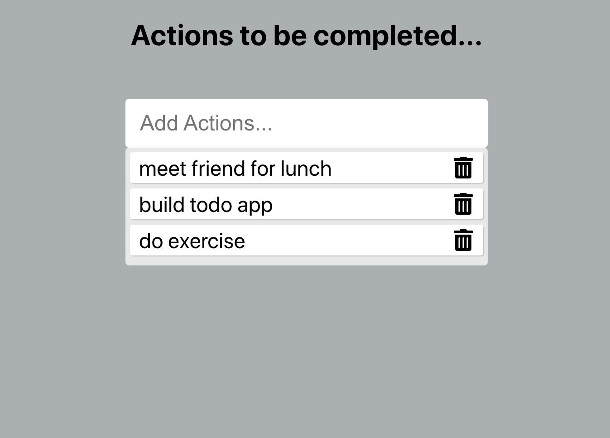
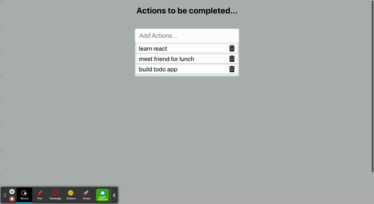

# Todo
  One can create a list of to do actions and delete those once its done using this project

**What I Learned**
- How to create a react application
- How to use ES6 features
- How to deploy a react project in github

**todo list**

## Description
- It has some default set of actions.
- Using the Input text you can insert new actions
- Once the actions is done, if you just click on the action it will be deleted

## Installation
- Download this project in your working directory through, \
git clone https://github.com/vanisbala/react-todo
- cd into the new folder and type
$ npm install
it will install the required dependencies.
- To run the react project
$ npm start
- You can add new actions are delete the existing actions in the list.
- You can also modify the project to include new features.

**Demo**

## Built with
- [HTML](https://developer.mozilla.org/en-US/docs/Web/HTML)
- [CSS](https://developer.mozilla.org/en-US/docs/Web/CSS)
- [JavaScript](https://developer.mozilla.org/en-US/docs/Web/Javascript)
- [React](https://reactjs.org/)

## Deployed Link
- [See live Site](https://vanisbala.github.io/react-todo/)

## Author
### Vani 
- [Link to Github](https://github.com/vanisbala)

## Credits
Thanks to MITxPRO for giving me the opportunity to work on this simple react project.

**Tutorials**
- [Steps to deploy react project in github](https://medium.com/mobile-web-dev/how-to-build-and-deploy-a-react-app-to-github-pages-in-less-than-5-minutes-d6c4ffd30f14)

